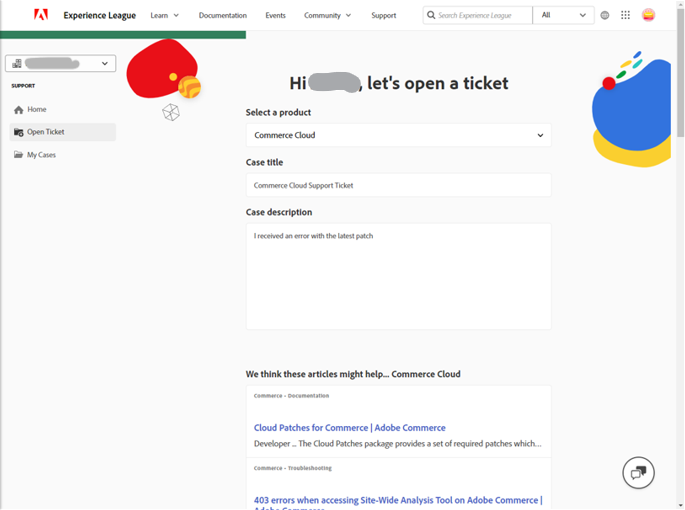

# Gebruikershandleiding voor ondersteuning van Experiencen League voor Adobe Commerce

In deze gids, leer hoe te om een steunkaartje aan [ Steun van het Experience League ](https://experienceleague.adobe.com/home#support) voor te leggen en gedeelde toegang tot de rekeningen van Adobe Commerce te verlenen.

>[!NOTE]
>
>Adobe Commerce-ondersteuning is gemigreerd van Adobe Commerce Help Center naar Experience League. Gebruik de hier beschreven stroom van de de gevalvorm van het Experience League  om steungevallen voor te leggen.

>[!NOTE]
>
>Op dit moment moet u naar https://support.magento.com/hc/en-us/requests gaan om uw eerder ingediende zaken te bekijken in het Adobe Commerce Help Center, aangezien deze gevallen niet naar het nieuwe systeem voor het plaatsen van ondersteuningstickets zijn gemigreerd. Het Centrum van de Hulp is nu read-only; om steun voor de originele kwestie te blijven ontvangen, zult u een follow-up kaartje aan [ de Steun van het Experience League ](https://experienceleague.adobe.com/home#support) moeten voorleggen.

>[!NOTE]
>
>Het gedeelte Knowledge Base van het Adobe Commerce Help Center is naar het Adobe Experience League-portaal gemigreerd. Wanneer u een ondersteuningsticket maakt, worden de bijbehorende artikelen in de Knowledge Base samen met andere relevante Adobe Commerce-documentatie van Adobe Experience League aan u voorgesteld.

**Belangrijke Update:** 29 juli, 2024

**[WAT IS DE STEUN VAN HET EXPERIENCE LEAGUE?](#what-is-experience-support)**

**[STEUNGEVALLEN](#support-cases)**

* [Aanmelden bij Experience League Support](#sign-in-experience-support)
* [Een ondersteuningskwestie indienen](#submit-case)

   * [Adobe Experience League-startpagina](#experience-league-start-page)
   * [Adobe Commerce-accountpagina](#submit-case-adobe-commerce-account-page)
   * [*Verifieer uw e-mailadres*](#verify-email-address-error)

* [Houd uw ondersteuningsgevallen bij](#track-support-cases)
* [Opmerkingen in uw geval](#comments-in-your-case)
* [Kwestie sluiten](#close-case)
* [De kwestie opnieuw openen](#reopen-case)
* [Een ticket verzenden met gebruik van Cloud Console](#cloud-console)
* [Adobe Commerce P1-hotline](#P1-hotline)
* [Adobe Commerce-operationeel model voor gedeelde verantwoordelijkheid](#shared-responsibility-operational-model)

**[GEDEELDE TOEGANG: VERLENER VOORRECHTEN VOOR ANDERE GEBRUIKERS OM TOT UW ACCOUNT TOEGANG TE HEBBEN](#shared-access)**

* [Wie gedeelde toegang kan verlenen](#who-can-provide-shared-access)
* [Gedeelde toegang bieden](#provide-shared-access)
* [Gedeelde toegang intrekken (verwijderen)](#revoke-shared-access)

   * [Hoe te om gebruikers te schrappen die gedeelde toegang via een project van de Wolk werden verleend?](#remove-cloud-shared-access-users)

* [Toegang tot gedeelde account (switchaccounts)](#switch-accounts)
* [Problemen met gedeelde toegang oplossen](#troubleshooting-shared-access)

**[HET VERPLETTEREN VEELGESTELDE VEELHEID VOOR ADOBE COMMERCE](#billing-faq)**

## WAT ONDERSTEUNT EXPERIENCE LEAGUE? {#what-is-experience-support}

De Steun van het Experience League is een steunportaal voor Adobe waar de in aanmerking komende klanten van Adobe Commerce steunkaartjes kunnen voorleggen en beheren. Dit is ook de locatie waar u artikelen voor het oplossen van problemen kunt bekijken.

## ONDERSTEUNINGSGEVALLEN {#support-cases}

Met Adobe Experience League Support Case Management kunt u voor alle Adobe Commerce-producten waarvoor een contract is gesloten, met ondersteuning werken door middel van gevallen om specifieke problemen op te lossen die zijn opgetreden bij het gebruik van Adobe producten, waaronder Adobe Commerce.

## AANMELDEN BIJ ONDERSTEUNING VAN EXPERIENCE LEAGUE {#sign-in-experience-support}

Door in te loggen kunt u vragen van medewerkers op ondersteuningstickets indienen, bijwerken en beantwoorden.

Voer de volgende stappen uit om u aan te melden bij Adobe Experience League Support:

1. Navigeer aan [ Experience.adobe.com ](https://experienceleague.adobe.com/).
1. Meld u aan met uw aanmeldingsgegevens voor de Adobe.

### Een ondersteuningskwestie indienen {#support-case}

Zodra u zich hebt aangemeld, kunt u een ondersteuningskwestie indienen via de homepage van Adobe Experience League, uw Adobe Commerce-accountpagina en uw Adobe Commerce Cloud-accountpagina.

* Voer de onderstaande stappen uit als u de eigenaar van de account bent.
* Als u een Gedeelde gebruiker van de Toegang bent, moet u eerst van rekeningen veranderen. Zie [ Toegang gedeelde rekening (schakelaarrekeningen) ](https://experienceleague.adobe.com/en/docs/commerce-knowledge-base/kb/help-center-guide/magento-help-center-user-guide#switch-accounts), en dan kunt u aan de hieronder stappen te werk gaan.

#### Adobe Experience League-startpagina {#experience-league-start-page}

Ga als volgt te werk als u een nieuwe ondersteuningskwestie wilt verzenden met de startpagina van Adobe Experience League:

>[!INFO]
>
>1. Als u een kwestie wilt indienen, moet u aanspraak kunnen maken op ondersteuning voor het desbetreffende product (bijvoorbeeld Adobe Commerce, Adobe Commerce Intelligence, Experience Platform, enz.). Als u niet gerechtigd bent om te steunen, zal een bar bij de bovenkant van de pagina verschijnen die u deelt dat u geen steun-gerechtigde gebruiker in de organisatie bent.
>1. Als u tot veelvoudige organisaties behoort of er veelvoudige organisaties met gelijkaardige-kijkt namen zijn (elk zal om het even welke andere producten van de Adobe vertegenwoordigen de organisatie abonnementen aan), zult u de aangewezen organisatie van dropdown eerst moeten selecteren.

>[!NOTE]
>
>Zorg ervoor dat u de juiste organisatie hebt geselecteerd voordat u de zaak indient en dat de door u geselecteerde organisatie over de juiste rechten beschikt voor het product waarvoor u ondersteuning aanvraagt. Bijvoorbeeld, als uw kwestie met Adobe Commerce verwant is, maar u had Experience Platform geselecteerd aangezien het product en de zaak met succes werd voorgelegd, kan dit tot misroutering van uw geval en vertragingen in reactietijden leiden.
>
>Als de verkeerde organisatie is geselecteerd, kan uw team de kwestie bovendien niet bekijken onder [!UICONTROL My Cases] voor de juiste/correcte organisatie. Het ondersteuningsteam beschikt niet over de mogelijkheid om de organisatie die aan de zaak is gekoppeld, in de toekomst te wijzigen.

1. Klik op **Steun** in de kopbal. Het zal de homepage van de Steun openen.

   

1. Zorg ervoor dat u de juiste organisatie hebt geselecteerd in de vervolgkeuzelijst Organisatie (indien zichtbaar) om het supportinnameproces te starten.

   

1. Klik op **[!UICONTROL Open Ticket]** in het linkermenu of klik op **[!UICONTROL Get Started]** op de kaart *[!UICONTROL Open a support ticket]* .

   

1. Selecteer een product in het vervolgkeuzemenu en geef een titel en beschrijving op. OPMERKING: als in de vervolgkeuzelijst geen producten worden weergegeven of als Commerce geen beschikbare optie is, probeert u in de linkerkolom van de module naar de gewenste organisatie te gaan en controleert u het opnieuw.

   

1. Adobe Experience League zal artikelen en tips en trucs voorstellen die je kunnen helpen je kwestie op te lossen. Als u nog steeds directe ondersteuning nodig hebt, moet u aanvullende informatie opgeven voordat u de kwestie kunt indienen.

   

1. Klik op **[!UICONTROL Submit case]** als u alle vereiste gegevens hebt ingevuld.

>[!IMPORTANT]
>
>Als u uw organisatie niet kunt zien in het dropdown menu van de organisatie wanneer u zich bij experienceleague.adobe.com aanmeldt, kunt u uw profiel moeten synchroniseren met accounts.magento.com alvorens om steun te verzoeken of een bestaand steungeval te beheren.   
>
>1. Navigeer naar accounts.magento.com en meld u aan met hetzelfde profiel (bedrijf, school of persoonlijk) dat u gebruikt om ondersteuningsgevallen in Adobe Experience League te beheren. 
>1. Nadat u zich hebt aangemeld bij uw accounts.magento.com-profiel, navigeert u terug naar experienceleague.adobe.com en meldt u zich aan. 
>1. Selecteer uw organisatie in het keuzemenu voor de organisatie. 
>1. Als uw organisatie nog steeds niet wordt weergegeven, neemt u contact op met uw Commerce-beheerder om rechten voor ondersteuningsgemachtigden te verkrijgen. Voor extra informatie, zie het ](https://experienceleague.adobe.com/en/docs/commerce-admin/start/commerce-account/commerce-account-share) hulpartikel van het Aandeel van de Rekening 0} Commerce. [

>[!NOTE]
>
>Waarom de organisatie/het product van belang is
>
>**Voorbeeld A**: U hebt toegang tot slechts één bedrijf gedeeld en dat bedrijf heeft rechten voor twee producten van de Adobe: Product1 en Product2.
>1. Aangezien elke organisatie één product vertegenwoordigt, zult u twee organisaties in dropdown zien, bijvoorbeeld, OrgA-Product1 en OrgB-Product2.
>1. Als u Product = Product1 selecteerde maar uw kwestie met Product2 verwant is, zal de zaak aan Product2 steun worden verpletterd en er zal vertragingen zijn wanneer het overbrengen van de zaak naar Product1 steun.
>1. Als u de zaak voor OrgA-Product1 indiende en [!UICONTROL My Cases] in de toekomst voor die Organisatie wilt herzien, zult u het niet zien als u OrgA-Product2 als Organisatie selecteert (u zou enkel de andere Organisatie moeten selecteren, in vergelijking met Voorbeeld B).
>
>**Voorbeeld B**: U hebt Gedeelde Toegang tot twee bedrijven, en elk bedrijf heeft slechts rechten voor Adobe Commerce.
>1. Als u de zaak voor OrgA indiende maar het probleem feitelijk OrgB beïnvloedt, zullen leden van OrgB deze zaak in de toekomst niet onder [!UICONTROL My Cases] kunnen zien.
>1. Daarnaast kunnen leden van OrgA gevallen onder [!UICONTROL My Cases] zien die eigenlijk bedoeld zijn voor OrgB, wat kan leiden tot privacyproblemen.

U moet over een account op zowel https://account.adobe.com als https://account.magento.com beschikken om u aan te melden bij het Experience League om een ondersteuningskwestie in te dienen. U kunt pas een ondersteuningskwestie verzenden nadat u bent aangemeld.

>[!NOTE]
>
>Als u al een account hebt op https://account.magento.com maar u niet kunt aanmelden, hebt u zich mogelijk niet geregistreerd voor een account op https://account.adobe.com, dat vanaf augustus 2022 vereist is.
>
>Dit probleem oplossen:
>1. Maak een account op https://account.adobe.com met hetzelfde e-mailadres op je MAG-id.
>1. Ga naar https://account.magento.com om uw Adobe ID te koppelen aan de MAG-id.

#### Adobe Commerce-accountpagina {#submit-case-adobe-commerce-account-page}

Ga als volgt te werk als u een nieuw ondersteuningsticket wilt verzenden via uw Adobe Commerce-accountpagina:

1. Meld u aan bij uw Adobe Commerce-account. Zie [ gedetailleerde instructies ](https://experienceleague.adobe.com/docs/commerce-admin/start/commerce-account/commerce-account-create.html?lang=en#create-a-commerce-account) in onze gebruikersgids.
1. Klik de **Steun** tabel.

   {width="800"}

1. De Adobe Experience League-ondersteuningspagina wordt voor u geladen.
1. Selecteer **[!UICONTROL Open Ticket]** in het linkermenu.
1. Vul de velden in.
1. Klik **voorleggen**.

#### *Gelieve te verifiëren uw e-mailadres* fout op de pagina van de Rekening van Adobe Commerce {#verify-email-address-error}

U zult geen steunkaartje kunnen voorleggen als u gelieve uw e-mailadresfout te verifiëren gelijkend op hieronder op de [ Adobe Commerce rekening ](https://account.magento.com/) pagina ontvangt.

### Houd uw ondersteuningsgevallen bij {#track-support-case}

Uw ondersteuningszaken zijn die van u:

* persoonlijk hebben ingediend.
* zijn toegevoegd als waterkant via een CC (koolstofkopie).

#### Bekijk je kwesties

U kunt de gevallen die u persoonlijk hebt verzonden, weergeven door op **[!UICONTROL My Cases]** in het linkermenu te klikken.

#### Je gevolgde kwesties bekijken

U kunt de gevallen bekijken u *aan als controleur* bent toegevoegd door **[!UICONTROL My organization's cases]** op het linkermenu te klikken.

<!-- TODO: Add image here -->

#### Zoeken naar gevallen

Om gevallen te vinden, typ uw onderzoeksvraag op het *[!UICONTROL Search]* gebied en druk *ga* op uw toetsenbord in.

#### Vergroot uw zaken

Als u van mening bent dat een zaak extra aandacht vereist en onze eerste reactietijd voorbij is, kunt u de zaak escaleren. Om dat te doen,

1. Klik op **[!UICONTROL Escalate to management]** rechtsonder in het deelvenster *[!UICONTROL Case Detail]* aan de rechterkant van het scherm.

   

1. Nadat u hebt geklikt, wordt een pop-upformulier weergegeven. Vul het formulier in en klik op **[!UICONTROL Escalate]** .

   

   *de Redenen voor escalatie kunnen* omvatten: Communicatie van de agent Vaardigheden, de Technische Kennis van de Agent, wachtend Callback/Update, Verandering in Kwestie Urgentie, Resolutie voldeed niet aan verwachtingen, of Tijd aan Resolutie.

#### Voeg een watcher toe aan ondersteuningsgevallen

U kunt watchers toevoegen om gevallen te ondersteunen die door leden van uw organisatie zijn ingediend. De kijkers zullen e-mailberichten ontvangen wanneer nieuwe gevallen worden voorgelegd of wanneer bestaande gevallen worden bijgewerkt.

1. Als u een watcher wilt toevoegen aan een bestaand hoofdlettergebruik, opent u het hoofdlettergebruik en klikt u op het potloodpictogram naast &quot;watchers&quot; in het deelvenster Details hoofdlettergebruik rechts van het scherm.

   

1. Nadat u op het potlood hebt geklikt, kunt u er wachtwoorden aan toevoegen of eruit verwijderen.

   

### Opmerkingen in uw geval {#comments-in-your-case}

Opmerkingen in uw geval bevatten alle opmerkingen die u of het Adobe Commerce-ondersteuningsteam hebben geschreven. Opmerkingen worden weergegeven van de laatste (boven) tot de vroegste (onder).
Ga als volgt te werk om een opmerking toe te voegen:

1. Blader naar de onderkant van uw ticket.
1. Schrijf uw opmerking in het veld **[!UICONTROL Comments]** en klik op **[!UICONTROL Add comments]** .

### Kwestie sluiten {#close-case}

Als u de kwestie wilt sluiten, klikt u op **[!UICONTROL Close case]** rechtsonder in het deelvenster *[!UICONTROL Case Detail]* .

### De kwestie opnieuw openen {#reopen-case}

Als u de kwestie opnieuw wilt openen, beantwoordt u de e-mail van ons supportsysteem met betrekking tot die zaak en vraagt u de medewerker om deze opnieuw te openen. Als u dit binnen 14 dagen na het sluiten van de zaak doet, kan de agent de zaak voor u opnieuw openen. Nochtans, als het na 14 dagen is, zal de agent een nieuw geval moeten creëren.

### Een ticket verzenden met gebruik van Cloud Console {#cloud-console}

Voer de volgende stappen uit om een nieuw ondersteuningsticket te verzenden met de Cloud Console:

1. Login aan de [ Console van de Wolk ](https://console.adobecommerce.com).
1. Selecteer **[!UICONTROL Support]** in het gebruikersmenu.
1. De pagina **[!UICONTROL My Tickets]** wordt geladen.
1. Klik op **[!UICONTROL Submit a ticket]** in de rechterbovenhoek.
1. Vul de velden in.
1. Klik **voorleggen**.
1. Klik op **[!UICONTROL Submit]**.

### Adobe Commerce P1-hotline {#P1-hotline}

Het [ P1 hotline van Adobe Commerce P1 ](https://experienceleague.adobe.com/docs/commerce-knowledge-base/kb/how-to/adobe-commerce-p1-notification-hotline.html) artikel verstrekt P1 hotline aantallen voor Adobe Commerce wanneer het zoeken hulp tijdens een P1 incident en verklaart welke informatie te verstrekken.

### Adobe Commerce-operationeel model voor gedeelde verantwoordelijkheid {#shared-responsibility-operational-model}

Zie het artikel op [ Adobe Commerce Gedeelde Verantwoordelijkheid Operationeel Model ](https://experienceleague.adobe.com/en/docs/commerce-operations/security-and-compliance/shared-responsibility#operational-responsibilities-summary),
waarmee wordt beoogd de operationele verantwoordelijkheden voor alleen ons Pro-infrastructuuraanbod te verduidelijken.

### Een vervolgticket openen {#follow-up}

Het openen van een vervolgticket zorgt ervoor dat de oorspronkelijke uitgave gekoppeld is aan het vervolgticket voor continuïteit.

Om een follow-up kaartje te openen, klik &quot;*creeer een follow-up*&quot;verbinding bij de bodem van het kaartje u wenst om een follow-up tot stand te brengen.

## GEDEELDE TOEGANG: BIEDT ANDERE GEBRUIKERS RECHTEN OM TOEGANG TE KRIJGEN TOT UW ACCOUNT {#shared-access}

Je kunt aan andere Adobe Commerce-rekeninghouders beperkte toegang tot je account verlenen. Met name, gebruikend de **gedeelde toegang** functionaliteit, kunt u voorrechten voor vertrouwde op werknemers en dienstverleners verstrekken om uw rekening van het Centrum van de Hulp te gebruiken zodat zij met uw steunkaartjes konden werken.

U kunt gedeelde toegang verstrekken en beheren gebruikend uw Adobe Commerce- rekeningspagina in [ https://account.magento.com ](https://account.magento.com/).

### Wie gedeelde toegang kan verlenen {#who-can-provide-shared-access}

Alleen de eigenaar van de account (primaire rekeninghouder) met de bijbehorende rechten kan andere gebruikers gedeelde toegang bieden.

Het beheren van gebruikers en hun toegang is de verantwoordelijkheid van de klant, vooral in het gedeelde toegangsperspectief. Het Adobe Commerce-ondersteuningsteam kan dus geen gedeelde toegang verlenen aan een Adobe Commerce-account namens een klant. De klanten worden aangemoedigd om gebruikers met gedeelde toegang zelf toe te voegen, gebruikend de [ de rekeningspagina van Adobe Commerce ](https://account.magento.com/).

Gebruikers die gedeelde toegang hebben gekregen, kunnen dergelijke toegang niet aan andere gebruikers overdragen of verlenen.

### Gedeelde toegang bieden {#provide-shared-access}

Zie [ een Commerce rekening ](https://experienceleague.adobe.com/en/docs/commerce-admin/start/commerce-account/commerce-account-share) sectie van Adobe Commerce delen Begonnen Gids voor gedetailleerde stappen bij vestiging een gedeelde rekening.

Na het verstrekken van gedeelde toegang voor een nieuwe gebruiker, is de verwante informatie beschikbaar in **Gedeelde Toegang** > **leidt Toestemmingen** van uw de rekeningspagina van Adobe Commerce.

### Gedeelde toegang intrekken (verwijderen) {#revoke-shared-access}

1. Login aan uw rekening van Adobe Commerce in [ https://account.magento.com ](https://account.magento.com/).
1. In het paneel op de linkerzijde, onder Gedeelde Toegang, kies **Beheers Toestemmingen.**
1. Vind de gebruiker om gedeelde toegang van terug te trekken en {width="25"} in de rij van de gebruiker (**Acties** kolom).
1. Klik **Gebruiker van de Schrapping** om toegang of X in de hoogste hoek terug te roepen om het terugroepen te annuleren.

   {width="800"}

   U kunt gedeelde toegang ook intrekken gebruikend **geeft** menu uit:

1. Login aan uw rekening van Adobe Commerce in [ https://account.magento.com ](https://account.magento.com/).
1. In het paneel op de linkerzijde, onder Gedeelde Toegang, kies **Beheers Toestemmingen.**
1. Vind de gebruiker om gedeelde toegang van terug te trekken en **te klikken geeft** in de rij van de gebruiker uit (**Acties** kolom).
1. Klik **Schrapping Deze Gebruiker** bij de bodem van de pagina.
1. In bevestigingspopup, klik **Gebruiker van de Schrapping** om toegang of X in de hoogste hoek terug te trekken om het terugroepen te annuleren.

### Hoe te om gebruikers te schrappen die gedeelde toegang via een project van de Wolk werden verleend? {#remove-cloud-shared-access-users}

<u> beïnvloede producten en versies </u>

* Adobe Commerce Cloud (alle versies)

<u> Oorzaak </u>

Als u een Adobe Commerce Cloud-project hebt of had gehad en een gebruiker aan het project had toegevoegd, zou automatisch Gedeelde Toegang op de MAGE-id van de eigenaar van het project zijn verleend. Dit zou normaal in de **[!UICONTROL Share Name]** kolom worden vermeld, tonend *Wolk Gedeelde Toegang van MAG [ XYZ]*.

Als de verbinding van DELETE ontbreekt, betekent dat dat de Gedeelde Toegang automatisch door Commerce Cloud werd verleend.

<u> Oplossing </u>

Het is niet mogelijk om de lijst van de Gedeelde gebruikers van de Toegang met de Naam van het Aandeel van *Wolk Gedeelde Toegang van MAG [ XYZ]* te schrappen als de Gedeelde Toegang niet op deze pagina werd toegevoegd/gegeven. Deze worden ter informatie/audit bewaard.

Nochtans, zodra u de toestemmingen voor die Gedeelde gebruikers van de Toegang hebt ingetrokken, zullen zij niet meer die toegang hebben.

1. Login aan uw rekening van Adobe Commerce in [ https://account.magento.com ](https://account.magento.com/).
1. Kies in het linkerdeelvenster onder *[!UICONTROL Shared Access]* de optie **[!UICONTROL Manage Permissions]** .
1. Zoek de gebruiker om gedeelde toegang van in te trekken en **[!UICONTROL Edit]** in de rij van de gebruiker te klikken (*[!UICONTROL Actions]* kolom).
1. Schakel alle bronnen onder *[!UICONTROL Grant Account Permissions]* uit.

{width="800"}

Voor meer informatie, gelieve te verwijzen naar de [ Manage de documentatie van de Toegang van de Gebruiker ](https://experienceleague.adobe.com/docs/commerce-cloud-service/user-guide/project/user-access.html#manage-users-from-the-project-web-interface) op onze Commerce op de Gids van de Infrastructuur van de Wolk.

### Toegang tot gedeelde account (switchaccounts) {#switch-accounts}

Voer de volgende stappen uit om de gedeelde toegang te gebruiken die aan u wordt geboden:

1. Login aan uw rekening van Adobe Commerce in [ https://account.magento.com ](https://account.magento.com/).
1. Klik het **menu van de Rekeningen van de Schakelaar** en selecteer een rekening.

   {width="800"}

Om te weten welke rekening u momenteel gebruikt (uw eigen inheemse rekening of gedeelde toegang), zie het **menu van de Rekeningen van de Schakelaar**: het toont de actieve rekening.

### Problemen met gedeelde toegang oplossen {#troubleshooting-shared-access}

Gelieve te verwijzen naar het [ Gedeelde artikel van het toegangsoplossen van problemen ](/help/troubleshooting/miscellaneous/shared-access-troubleshooting.md) in onze basis van de steunkennis.

## VEELGESTELDE VRAGEN VOOR ADOBE COMMERCE {#billing-faq}

De handelaren betalen typisch voor onze diensten door een creditcardtransactie (CC), en dit [ Facturerende FAQ voor Adobe Commerce ](/help/faq/general/billing-faq-for-adobe-commerce.md) is een middel om u bij te staan wanneer u uw rekening betaalt.

