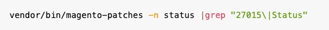

# Achterwaarts incompatibele wijzigingen voor [!DNL GraphQL] `placeOrder` [!DNL API] in Adobe Commerce 2.4.6-p8

Dit artikel bevat een patch voor de bekende Adobe Commerce-versie 2.4.6-p8 Cloud- en On-premisse kwestie waarbij `placeOrder` [!DNL GraphQL API] geen verwachte foutreactie retourneert, zoals in eerdere 2.4.6-patchversies werd getoond. Dit kan leiden tot een gebroken afrekenervaring voor verkopers die [!DNL PWA] storefront of een andere [!DNL GraphQL API] -gebaseerde winkel voor hun winkels gebruiken.

>[!NOTE]
>
>Neem contact op met de ondersteuningsservices als u problemen ondervindt bij het toepassen van de patch.

## Betrokken producten en versies

* Adobe Commerce op Cloud 2.4.6-p8
* Adobe Commerce op locatie 2.4.6-p8

## Probleem

Na de verbetering op Adobe Commerce 2.4.6-p8 veiligheid-enige flard, [`placeOrder` [!DNL GraphQL API] ](https://developer.adobe.com/commerce/webapi/graphql/schema/cart/mutations/place-order/) keert geen verwachte foutenreactie terug, zoals die in om het even welke vorige 2.4.6 flardversies wordt gezien. Dit kan leiden tot een gebroken afrekenervaring voor verkopers die [!DNL PWA] storefront of een andere [!DNL GraphQL API] -gebaseerde winkel voor hun winkels gebruiken.

<u> Stap om te reproduceren </u>:

Voer de `placeOrder` [!DNL GraphQL] -aanvraag uit op het punt waar u een foutreactie verwacht.

<u> Verwacht resultaat </u>:

U ontvangt een verwacht foutantwoord.

<u> Werkelijk resultaat </u>:

In plaats van een verwacht foutantwoord ontvangt u een succesvol antwoord, maar met een nieuwe `errors` -toets die er als volgt uitziet:

```
{
    "data": {
        "placeOrder": {
            "order": null,
            "__typename": "PlaceOrderOutput"
        }
    }
}
```

## Oplossing voor Adobe Commerce op software voor cloud en Adobe Commerce op locatie

U kunt dit probleem oplossen door de pleister aan te brengen.
Klik op de volgende koppeling om deze te downloaden:

[ac-13283-composer-patch.zip](assets/ac-13283-composer-patch.zip)

## Hoe de pleister aanbrengen

Pak het dossier uit en zie [ hoe te om een componentenflard toe te passen die door Adobe ](https://experienceleague.adobe.com/docs/commerce-knowledge-base/kb/how-to/how-to-apply-a-composer-patch-provided-by-magento.html) in onze basis van steunkennis voor instructies wordt verstrekt.

## Alleen voor Adobe Commerce op Cloud-handelaren - Hoe kan ik zien of er patches zijn aangebracht?

Aangezien het niet mogelijk is om gemakkelijk te controleren of de kwestie werd gepatcheerd, zou u kunnen willen controleren of de flard met succes is toegepast.

<u> u kunt dit doen door de volgende stappen te nemen, gebruikend het steekproefdossier `VULN-27015-2.4.7_COMPOSER.patch` **als voorbeeld</u>**:

1. [ installeer  [!DNL Quality Patches Tool] ](https://experienceleague.adobe.com/docs/commerce-operations/tools/quality-patches-tool/usage.html).
1. Voer de opdracht uit:<br>
   
1. U zou output gelijkend op dit moeten zien, waar VULN-27015 de *Toegepaste* status terugkeert:

   ```bash
   ║ Id            │ Title                                                        │ Category        │ Origin                 │ Status      │ Details                                          ║ ║ N/A           │ ../m2-hotfixes/VULN-27015-2.4.7_COMPOSER_patch.patch      │ Other           │ Local                  │ Applied     │ Patch type: Custom                                
   ```

<!-- For Step 2:
     ```bash
    vendor/bin/magento-patches -n status |grep "27015\|Status"
     ```
-->

