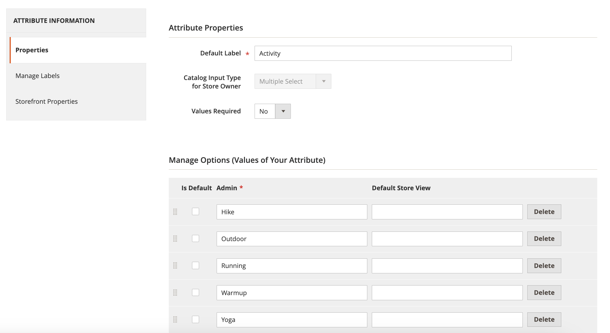

# [!DNL Live Search] facetten worden niet alfabetisch gesorteerd

## Betrokken producten en versies

Adobe Commerce 2.4.x en hoger

Alle Adobe Commerce-storefront-facetten worden alfabetisch gesorteerd met opties voor één keuze, ongeacht het invoertype dat aan het overeenkomstige kenmerk is toegewezen.

Nochtans, in bepaalde randgevallen, zouden de facetten niet alfabetisch zoals opstelling in de [[!DNL Live Search]  Facetterende werkruimte ](https://experienceleague.adobe.com/en/docs/commerce-merchant-services/live-search/live-search-admin/facets/faceting-workspace) kunnen sorteren. Als tijdelijke oplossing kunt u productkenmerken sorteren in de sectie [!UICONTROL Admin] Kenmerken.

1. Op **[!UICONTROL Admin]** sidebar, ga **Sporen** > *Attributen* > **Product**.
1. Selecteer een kenmerk in de tabel.

   

1. Open de attributen die de waarden heeft u **Informatie van Attributen** > **Eigenschappen** sorteren en selecteren.
1. Onder **beheert Opties**, kunt u de attributenwaarden sorteren.

   
